# Voyager

View my live project here! [Voyager](https://jonathanwhitedev.github.io/voyager/) 

Voyager is a new website club and newsletter designed to celebrate our unique planet and the thousands of different cultures and traditions each country or territary around the world possesses. This weekly newsletter provides the user with fundamental and educational information on what each country has to offer from inspiration, adventure, travel tips, folklore tales and interviews, religious festivities, amazing food and drinks recipes, and local events. Therefore it remains inclusive for people to be involved without having to travel to featured country. The aim is to provide 1 month of 4 different and vibrant newsletters by sign up, which are emailed to the user to get a varied and informative grasp on each location. These are always fun filled and educational. A new month provides an entirely different and unique country to explore in fabulous detail. Our first month features Iceland.

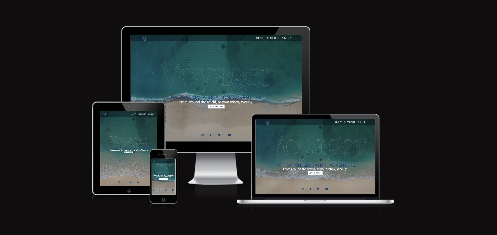

The following responsive screensizes of my website can also be found here: (https://ui.dev/amiresponsive?url=https://jonathanwhitedev.github.io/voyager/index.html)

## User Stories and UX

- __As a visiting user, I would like to signup for the newsletter.__

As part of the UX specification and planning phase it was noted that there are currently no available newsletter websites that offer services to consumers looking for varied inspirational and educational tips of countries around the world in great detail. This was an opening to provide a website that provided a sign up for people. A multitude of people surveyed agreed that there was no website that offered such a vast array of information with a free newsletter, sent weekly via email. This would be something they felt would be a valuable USP. 

- __As a visiting user, I would like to be inspired and educated.__

Over three quarters of those surveyed (100) also came to agreement there was no one place online that provided inspiration for holidays and trips with such great detail on places to visit, sites to see, unique experiencs to enjoy such as festivities, best times of the year to visit with links to external resources such as travel advice provided by goverment bodies etc.

- __As a visiting user, I would inspiration to try at home.__

Another shortfall noticed was that for those who would like to experience a new vibrant culture but were unable to physically travel there, would benefit greatly from recipes and drinks menus and local events happening around the UK that celebrated the culture being displayed for that month. For example Diwali celebrations happening in London, restaurants that serve the most authentic food from that nation with reviews, educational facts and stories of that country that can be read by children and adults alike. Almost all that were surveyed in the UX consulation stage agreed there was no one website that provided all this useful information and more, so readily availabe as Voyager.

- __As a visiting user, I would like concise, clear information.__

Each page on the Voyager website (Home, Spotlight, About, Sign-up and Welcome) keep a clear and modern layout throughout that is accessible for all, gives the user an easy to follow grasp of what the website offers.

## Home Landing Page
Home provides a simple and clean layout with key information on what the website offers "Inspiration. Education. Adventure. From around the world, to your inbox. Weekly". This is followed with a clickable button of "Lets Explore" which sends the user dthrough onto the next page. A dreamlike hero video is also displayed to cover entire background, this provides user a sense of the website and evokes memories of holidays, travelling and good times, all which provide a positive user experinece. A large "Voyager" font in modern text in the centre of the page keeps the attracts the user to the modern lines. A Small company logo in the top right of the website is also used as a clickable link to get back to the homepage at any point and reamins on all pages. A simple to understand navigation tab also allows user to easily navigate clickable pages. Lastly a footer of the social media links for Voyager is also provided on every page.

## About

The about section aims to provide key information to the user in a playful manner to introduce the company Voyager and provide infomration on what to expect upon signing up to their free newsletter.
 Again, A Small company logo in the top right of the website is also used as a clickable link to get back to the homepage at any point and reamins on all pages. A simple to understand navigation tab also allows user to easily navigate clickable pages. Lastly a footer of the social media links for Voyager is also provided on every page.

## Spotlight

Spotlight provides a free no obligation sign up view of what is on offer in this weeks free newsletter. The focus for this month is Iceland and shows the user a basic undertstanding of what to expect on sign up of the newsletter. 
 Again, A Small company logo in the top right of the website is also used as a clickable link to get back to the homepage at any point and reamins on all pages. A simple to understand navigation tab also allows user to easily navigate clickable pages. Lastly a footer of the social media links for Voyager is also provided on every page.

## Sign-Up
Sign up page provides the form and reiterates what the user is signing up for with a simple easily readable paragraph. a simple form consisting of "first name" "last name" and "email address" and clickable submit button. All entries of the form must filled out in order to signup. A prompt will follow if any information is missed or not filled out inlcuding a @ symbol. Upon sign up, a new linked page loads up on external webpage to confirm free subscription and a thank you. This is called "Welcome aboard Voyager".
 A Small company logo in the top right of the website is also used as a clickable link to get back to the homepage at any point and reamins on all pages. A simple to understand navigation tab also allows user to easily navigate clickable pages. Lastly a footer of the social media links for Voyager is also provided on every page.

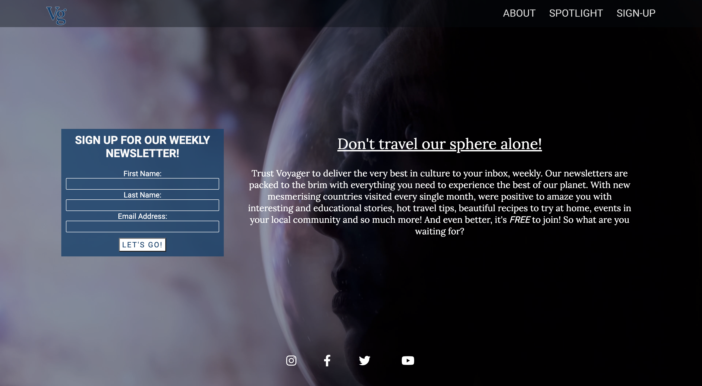

## Welcome
This is a hidden page only appearing upon successfully signing up to the newsletter. this tells the user that sign up has been successful and to expect free newsletters in their inbox weekly. There is information on no spam promise as well as being able to unsubscribe at any time. A clickable link is supplied to return home as well the same nav and social links as all previous pages.

## Features 

Voyager includes the following;

### Existing Features

- __Navigation Bar__

  - Featured on every page, the fully responsive navigation bar includes links to the Logo "Vg" which takes the user back to the  Home page, an About page, Spotlight page and Sign Up page are also in the nav bar and is identical in each page to allow for easy navigation.
  - This feature will allow the user to navigate effortlessly from page to page across all devices without having to revert back to the previous page via the ‘back’ button. 

  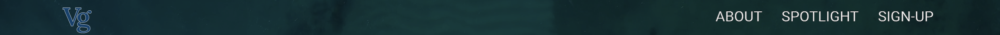

- __Form__
  - The Form in the Sign up section provides the user a easy, fast, and efficient way to sign up to our newsletter without taking unnecessary information such as birthday, gender, home address etc. The informtion is transparent and the user undertsands this is a totally free service that is emailed in newsletter form, weekly. The user will see the value of signing up for the newsletter and what it brings to them. All detial are required to sign up (first name, last name and email) otherwise a mandatory message appears.

  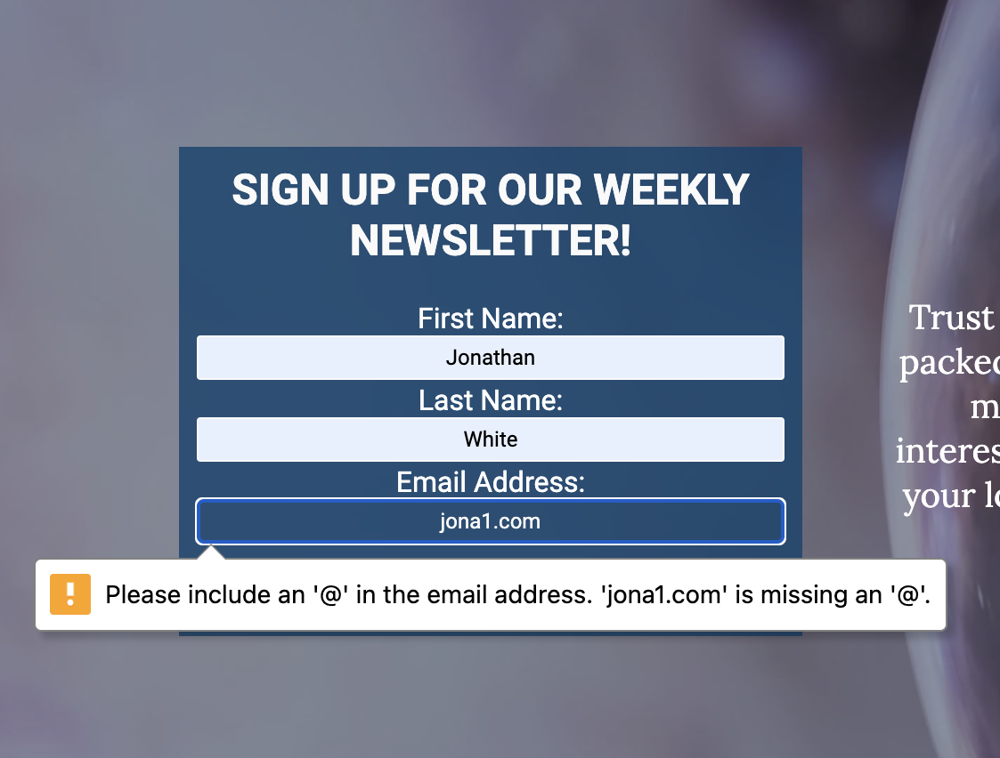

- __Button__
  - A button is on every page and uses an intuitve way for the user to quickly scroll between all the pages (in order) of appearance. The user knows they have scrolled over the button as it inverts its colours and has a text transformation to capture the attention of the user.
 
  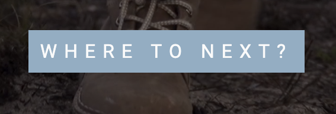

- __The Footer__ 

  - The footer section includes links to the relevant social media sites for Voyager. The links will open to a new tab to allow easy navigation for the user. 
  - The footer is valuable to the user as it encourages them to keep connected via social media where they can find out even more about Voyager and its accreditations elsewhere.

  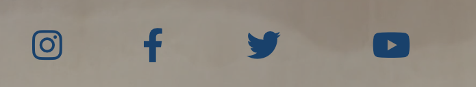

### Future features Left to Implement

- Future features will include a brand new month discovering a completely new culture and country. This happens on the 1st day of a new calender month. Next months new feature country will be India.
- A competion page section where by users can win gift vouchers with flight partners and or travel agents to spend towards their next trip. And other prizes including educational books or experiences. This page will contain information provided on how to partake in the competion. This will again make clear to the user that valid sign up credentials will be required in order to compete.
- Share with us page. This page will be dedicated to the user to share their experiences and tips with the country they have visted in previous monthly features. This will be a toolbank for new and existing users that can see what benefits were provided by Voyager in the past and what values or experiences they gained by being a member. This may include, pictures with stories about visiting a featured loaction, restaurants they visited, meal they cooked, book they read etc. There will be form for users to share their experiences with us on past features which will provide a new link form with extra information and image uploads etc.
- There will be a seperate search page and search bar included for the user to filter searches by keyword or country. If the country is not yet listed it will explain to the end user that this will be featured in a future release of monthly drops in time. This will be a great tool for end users to find previous features and refreshers if they need the information again to refer back to.

## Typography and Colour

- Typography was taken from Google Fonts using 2 base fonts, "Lora" and "Roboto". I felt these complimented each other very well, were clean and clear to read and easily accessible. Lora was used mainly for larger h1 and h3 texts and Roboto for everything else. With colour schemes I chose to use 3 colours using hex (RGB was used initially until i converted to hex) I used a darker navy blue (#00426e), mid blue (#8eaec4) and basic white (#fff) to keep a uniformed approach. I then used a background for my vidoes to have a deeper and darker brightness value using (#030a0f66) so that the white text would pop off the display video. I then took the brightness down further for the header using the same colour to differentiate from the background video.

Google Fonts can be found here (https://fonts.google.com/)

## Wireframes
- I used Balsamiq for my wireframes and drew a rough design of what I wanted my website to look like with background images instead of video due to it's limitations, all content including wording is accurate and adeared to throughout into deployment of website. Agai due to limitations i wanted the wording to be bigger on the Voyager text but with balsamiq it wasnt possible to make the main text big enough in the page, I made sure to carr this over into my website. You can see screenshots of these pages below, the only page not included is the welcome page which i didn't remember to add at the time!

Index Page
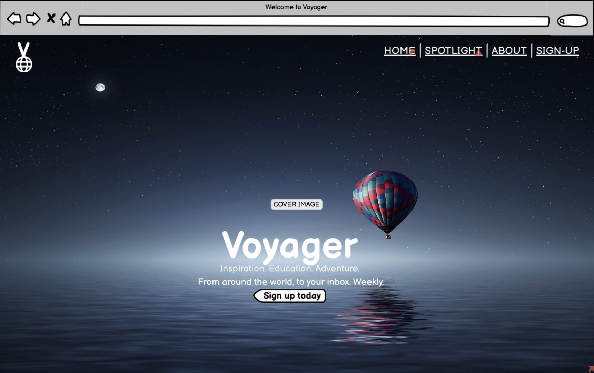

About Page
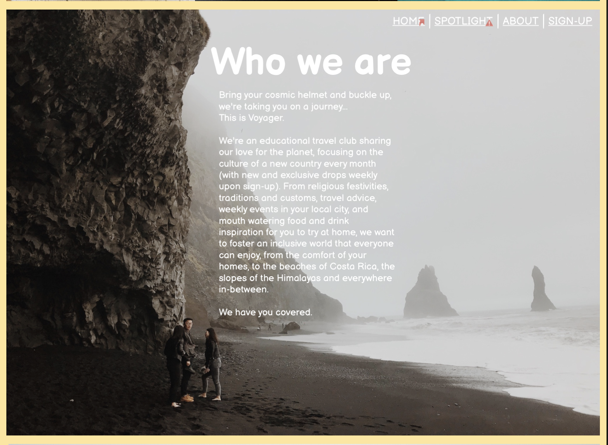

Spotlight Page
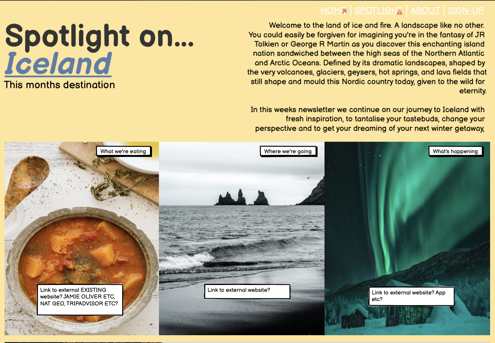

Sign-Up Page
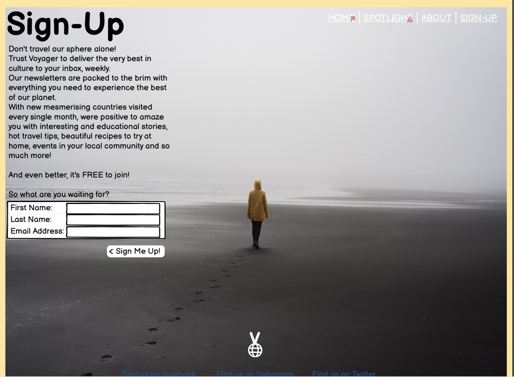

## Technology
__Various technologies were used in the entire process of building this website as follows;__
- Balsamiq. This was used to make a rough template of the design of my website.
- GitHub. To build the repository for Voyager and lay the groundwork for its development and deployment of website.
- GitPod. Where the design came to life in the physical coding of the website building the files and folders and writing the code to commit back to GitHub. This beginning of this Readme file was written before coding took place and exxtra folders were added for HTML and Assets including CSS and media.
- HTML. The building block for all the code and written across 5 pages, index, about, spotlight, signup, welcome.
- CSS. The style of the website linked via stylesheets to the HTML code.
- Fontawesome. Used to take social media icons for the bottom of the page.
- Google Fonts. All font styles were taken to add a more unique design.
- Pexels. Where all video media came from using mp4 files.
- W3 Validator. Used to ensure all HTML code was working with no errors.
- Jigsaw Validator. USed to ensure all CSS code met best practices and was working with no errors.
- Lightouse. Used to ensure testing of performance met expectations wit no severe errors or performance issues. 

## Testing 

Overall, I am very happy with the testing outcomes with lighthouse, HTML, and CSS validation. I was concerned the video backgrounds may have an effect upon this but im glad that choosing short videos with lower quality may have helped my cause with this. I have tested all pages and functions, clickable links of social media links in nav bar as well as buttons, forms, and nav bar buttons. All of these work fast and clean for optimisation for the user to have a streamless experience on the website, all of their goals can be met simply and concisely with straightforward webpages that are engaging.

I have tested this website on a macbook pro with a 32 inch external monitor, an Ipad Pro, and a Iphone 13 pro max. I have also used reponsive design in Google dev tools with other devices such as a Surface Duo, Samsung galaxy devices including the fold, and other smaller devices of 280px max width. These were written with extensive media queries to be inclusive for all users regardless of the device they use.

It is noticed however that video backgrounds do not tend to work on smartphones - my personal iphone 13 pro max for instance. This may be because of the memory usage this website requires, however, i am happy that although the video may not play, a still of the video is still present and does in no way detract from the user experience and all functions still work fast and efficiently.

### Performance Testing 

- Lighthouse (Chrome Dev Tools)
  - No performance issues were returned when passing through the official Lighthouse feature on google chrome dev tools [https://developer.chrome.com/docs/lighthouse/overview/] on all 5 HTML pages of website. Scores of over 90% were present throughout as per following screenshots:

  Index Page
 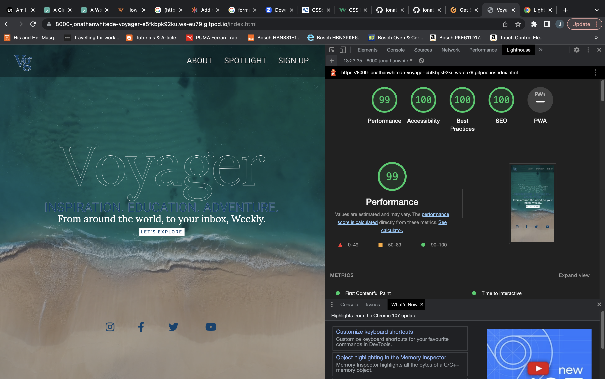
  
  About Page
 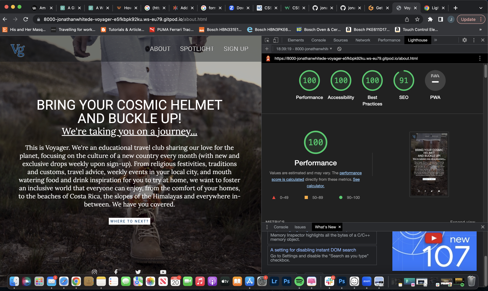

  Spotlight Page
 

  Sign Up Page
 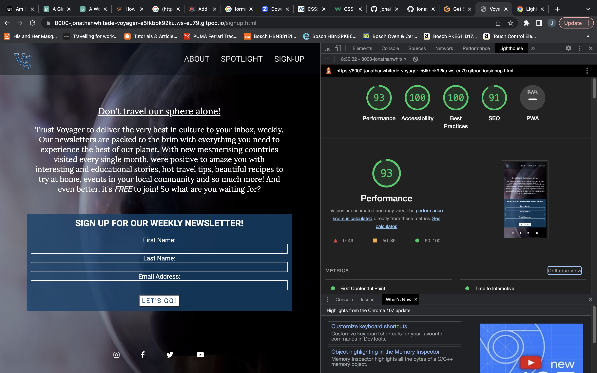

  Welcome Page
 

### Validator Testing 

- HTML
  - No errors were returned when passing through the official [W3C validator] on all 5 HTML pages of website as follows: Index (https://validator.w3.org/nu/?doc=https%3A%2F%2Fjonathanwhitedev.github.io%2Fvoyager%2Findex.html) Spotlight (https://validator.w3.org/nu/?doc=https%3A%2F%2Fjonathanwhitedev.github.io%2Fvoyager%2Fspotlight.html) About (https://validator.w3.org/nu/?doc=https%3A%2F%2Fjonathanwhitedev.github.io%2Fvoyager%2Fabout.html) Sign Up (https://validator.w3.org/nu/?doc=https%3A%2F%2Fjonathanwhitedev.github.io%2Fvoyager%2Fsignup.html) Form (https://validator.w3.org/nu/?doc=https%3A%2F%2Fjonathanwhitedev.github.io%2Fvoyager%2Fsignup.html)
- CSS
  - No errors were found when passing through the official [(Jigsaw) validator](https://jigsaw.w3.org/css-validator/validator?uri=https%3A%2F%2Fjonathanwhitedev.github.io%2Fvoyager%2F&profile=css3svg&usermedium=all&warning=1&vextwarning=&lang=en)

### Test Cases
__Sign Up Page Testing:__
1. Click on the sign up option on the nav bar. User should be redirected to signup page.
2. Click Lets go button. User should notice error "Please fill in this field." on the First Name if it is not entered and ask for this information.
3. Same will be applied if Last Name and Email are left blank, with same error.
4. Until all fields are filled in, submission can then take place clicking the "Let's Go" button and redirect the user to a Welcome Page confirming sign up has successfully taken place.
5. All testing was completed, and all was working satisfactory.
6. See Screenshots below of test outcomes.

 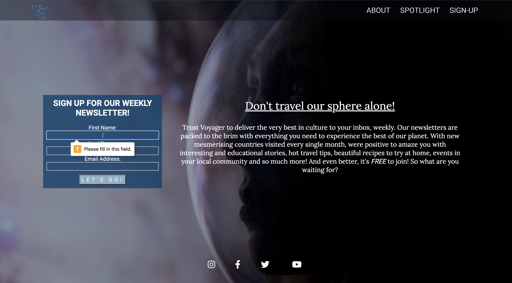
 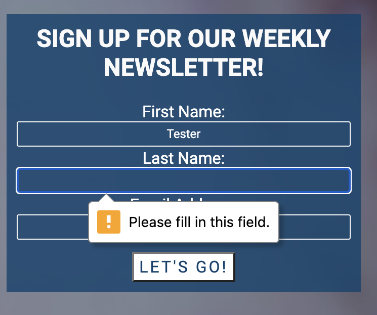
 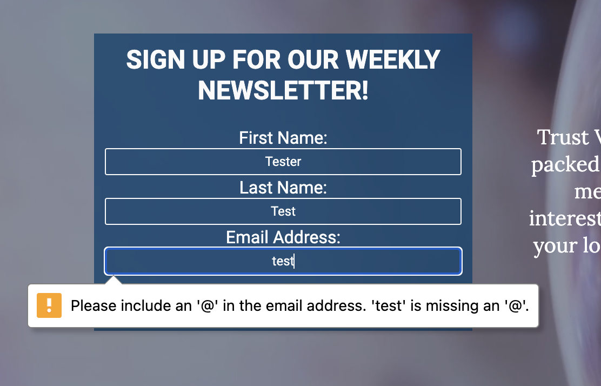

 __Social Link Testing:__
 1. User hovers over any of the 4 social media links at bottom of page. An animation should take place where the link rises 5px upwards as a transition.
 2. A pop up text also appears on hover that displays a message that the website will open on in a new tab. 
 3. When clicked upon any of the 4 links, it will open in a seperate new tab.
 4. All testing was completed, and all was working satisfactory.
 5. See Screenshots below of test outcomes.

 
 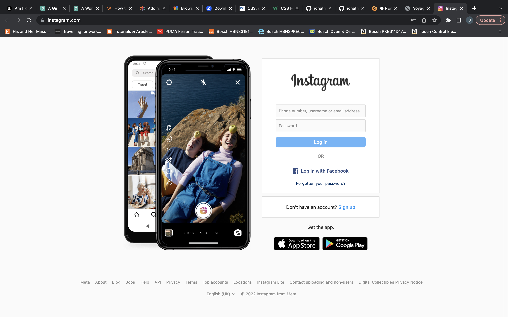

 __Button Testing:__
 1. User clicks on any button in the "Nav" bar on any page, and was tested for fast accurate response to open the page intended.
 2. User clicks on the "Vg" Button in top right of page and this will always bring the user back to the Home or "index.html" page.
 3. User can click on any of the coloured buttons on all pages "Lets Explore", "Where to Next?", "Sign Up Today", "Lets Go" (form section), and "Back to Home" and again thry are fast and direct and move the user intuitively through the website without relying on the Nav bar (although this too can be used at any point)
 4. When hovered over the coloured white buttons, these will expand in transition and the background colour and text colour will revert to opposite in colour.
 5. All testing was completed, and all was working satisfactory.
 6. See Screenshots below of test outcomes.

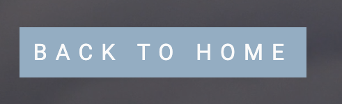

__Video Background Testing:__
 1. User views the playing Video source in the background. 
 2. These should continue to play without interuption and loop and repeat on completion so they continually loop and play on all 5 pages.
 3. Watching the transistion on all 5 pages confirmed this took place and replayed on loop.
 3. All testing was completed, and all was working satisfactory.

### Supported Browsers and Screen Sizes.
  - Testing was carried out on Google Chrome, Safari, and Mozilla Firefox. All played the video and content fast and reponsively across these browsers.
  - Testing was carried out on Macbook Pro M1, Ipad Pro, and Iphone 13 Pro Max models in personal collection. I also optimized for other devices such as a Surface Duo, Samsung galaxy devices including the fold, and other smaller devices of 280px max width. All passed these tests.

### Unfixed Bugs

No extra bugs were found upon testing through above and I'm happy this is a responsive clean webpage. 

## Deployment
  - The site was deployed to GitHub pages. The live link can be found here - https://jonathanwhitedev.github.io/voyager/

  __To deploy the project:__
   1. In the [GitHub repository](https://github.com/jonathanwhitedev/voyager), Navigate to the settings tab.
   2. Once in the settings, navigate to the pages tab on the left hand side.
   3. In the build and deployment section under Branch, select the "master" branch and click Save.
   4. Once the master branch has been selected, the page will be automatically refreshed and a display indicates the successful deployment and the link to the address as below.
   5. All steps pictured below with corresponding numbers.

   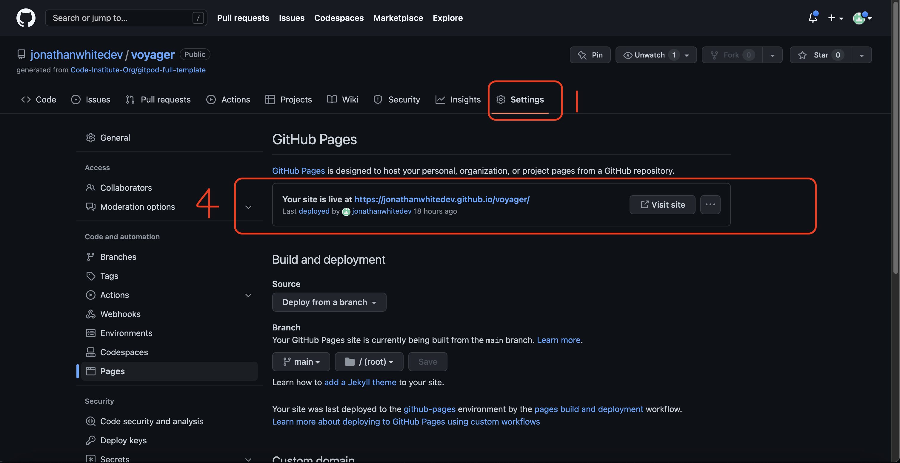

__To open Gitpod and Voyager website preview:__
   1. In the [GitHub repository](https://github.com/jonathanwhitedev/voyager), click the green Gitpod button. This will open GitPod.
   2. Once in GitPod, click the tab hamburger button in top left corner, navigate to Terminal and highlight and click "New Terminal".
   3. In the Terminal after gitpod /workspace/voyager, type the following command "python3 -m http.server" and hit the enter key.
   4. Once entered correctly a pop up will appear in bottom left corner displaying a service port is available. Click "Open Browser" and the website preview will open in a brand new tab.
   5. All steps pictured below with corresponding numbers.

   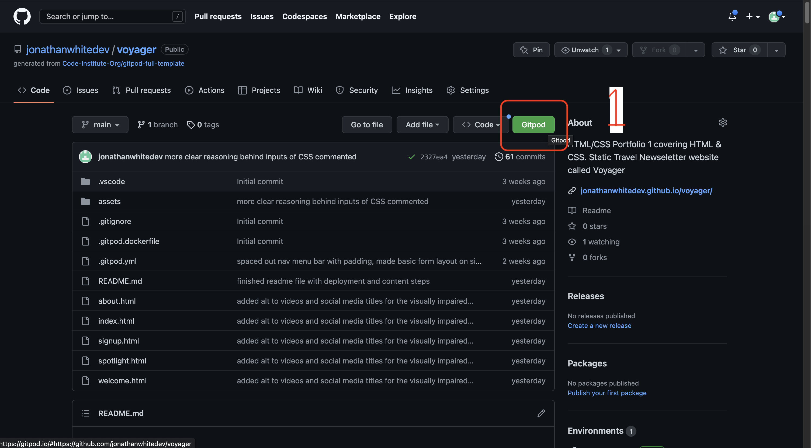
   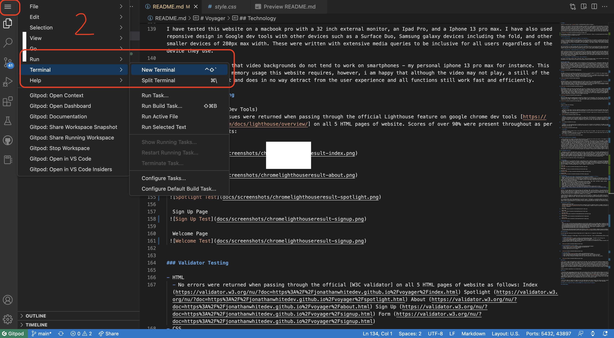
   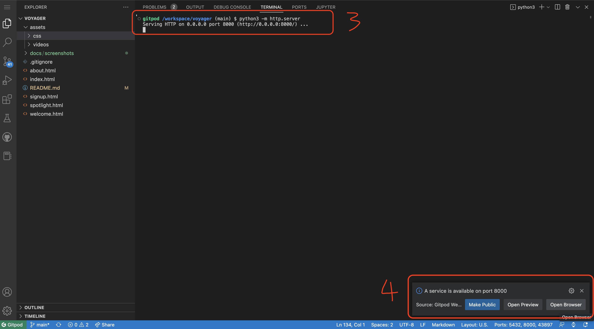

### Extra Deployment Tasks
 __To run the website on a local screen:__
   1. Go to the [GitHub repository](https://github.com/jonathanwhitedev/voyager).
   2. Once in there, click on the green Code button and Download ZIP.
   3. Extract the ZIP file on your local machine.
   4. Run the index.html file in a browser.
   5. All steps pictured below with corresponding numbers.

   

 __To clone the repo:__
   1. Go to the [GitHub repository](https://github.com/jonathanwhitedev/voyager).
   2. Click on the green Code button and directly underneath as shown, copy the HTTPs link there.
   3. Open a GitBash terminal and navigate to the directory where you want to locate the clone.
   4. Type "git clone" and paste the copied HTTPs link, press the enter key to begin the clone process.
   5. All steps pictured below with corresponding numbers.

   

## Credits 

I will firstly credit code institute for the help with this page, the love running project helped me immensely when i found the going tough or needed to remember small details such as how to use social link tags etc. I also want to shout out to the code institute tutors for some help on minor tweaks to point me in directions where i was a little lost and they helped me understand where i was going wrong. Lastly i'd like to thank my dilligent mentor who helped me research other areas such as flexbox and grid, and even told me to start with developing in mobile screens firstly and start backwards from there to desktop. (oh if i had only listened to that last advice, would have saved me so much time!) This was a steep learning curve for me but because of the minor mistakes and not following flex/media at the beginning i learnt the hard way and in turn learnt an awful lot through the stress of it all!

Content and media inspiration is as follows below;

### Content 

- The button anchor tags design sections were taken from finding them on Traversy Media youtube channel and video https://www.youtube.com/watch?v=8MgpE2DTTKA&t=1114s these were then redesigned further with colour that was suitable for the page and font/sizes. The same video was also used for finding social li a transform scales to improve look of social icons and pop from page.
- The social icons in the bottom of section of all pages were taken from [Font Awesome](https://fontawesome.com/)
- The webkit stroke function was found after heavy research in needing a solution to allow text to pop off the background to be unique and more readble against the background colours and video content, this was found at (https://css-tricks.com/adding-stroke-to-web-text/) I then incorporated this into my css for my specific needs.

### Media

- All of the videos (5) used on all pages are from This Open Source site (http://pexels.com) these were then resaved as different file names, as text was either in russian or had spaces and would fail testing or reading for other developers.

## Thank you for taking the time to view my README file, hope you enjoy the website. 

## Jonathan White